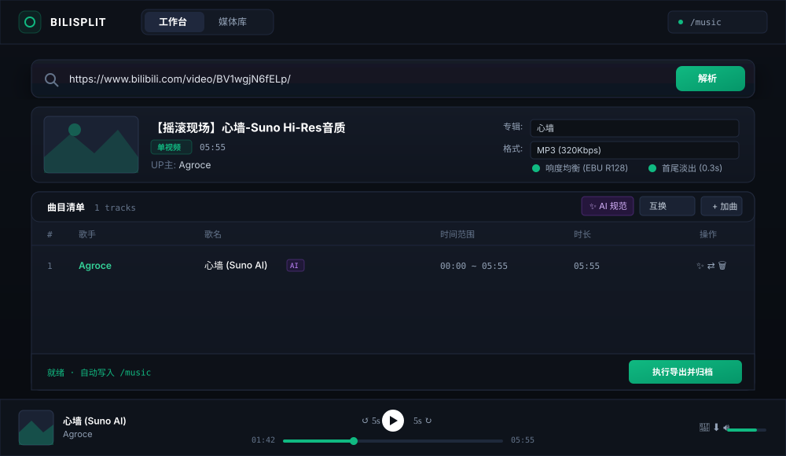

<div align="center">

# BiliSplit

### 哔哩哔哩音乐提取与自动化归档工作站 (Linux / LXC 原生版)

专为 Linux 与 LXC 容器（Proxmox VE / Ubuntu / Debian）设计的音频提取与媒体归档系统。

[](https://github.com)
[](https://github.com)
[](https://github.com)
[](https://github.com)
[](LICENSE)

<br/>



</div>

---

## 🌟 核心特性与功能

### 🎛️ 工业级双视图工作区 (Dual-Engine Workspace)
* **提取工作台 (Workstation)**：输入视频链接即可秒级解析，呈现原画封面、分段曲目与元数据编辑表；支持行内即时校对、一键互换歌手与歌名。
* **持久化媒体库 (Library)**：内置 SQLite 数据库，全量记录归档历史；支持按曲名、歌手、专辑实时模糊检索，随时流式调阅或单曲复下。

### 🔊 广播级音频均衡与平滑过渡
* **EBU R128 工业级响度标准化 (Loudness Normalization)**：自动均衡不同创作者、不同合集音源的播放响度，杜绝切歌时忽大忽小的听觉落差。
* **智能平滑淡入淡出 (Smart Micro-Fade)**：切分音轨首尾自动置入 0.3 秒平滑微淡出，消除视频切片边缘的突兀咔哒爆音。

### ✨ 智能元数据规范与曲风过滤 (AI Curation)
* **智能噪词过滤**：深度剥离“摇滚现场”、“伤感慢摇”、“纯音乐”等曲风/场景干扰词，保留纯净曲目核心。
* **AI 决策引擎接入**：分层策略结合规则引擎与大模型网关，针对复杂翻唱、Live 现场、AI 改编等非标标题，一键自动校对为标准规范：`歌手 - 歌名 (版本/Cover).mp3`。
* **原生 ID3 封装**：写入歌曲名、歌手、专辑及原画级高清封面（无任何多余歌词），车机与专业播放器即插即用。

### ⚡ 官方高速直连流提取
* **官方高带宽 CDN 直通**：自动探测并锁定官方主力 CDN 节点，彻底杜绝 PCDN / MCDN 解析超时与连接中断。
* **多格式高品质输出**：提供 MP3 (320Kbps 高保真)、FLAC (无损级)、M4A (原音轨流提取) 自由切换。

### 🎶 全局常驻音频播放器
* 界面底部常驻沉浸式流式音频控制台，支持时间轴毫秒拖拽微调、前退 5 秒快速定位、无级音量调节与实时封面渲染。

### 🐧 Linux / LXC 容器原生就绪
* 采用 Linux 标准目录规范，歌曲自动归档至宿主挂载点 `/music`（无缝衔接 NAS 与各类流媒体服务器）。
* 开箱自带 Systemd 守护进程与自动化部署脚本，开机无感自启。

---

## 🚀 快速部署指南 (Linux / LXC)

### 选项 A：Debian / Ubuntu / LXC 容器一键部署 (推荐)

进入 LXC 容器终端（或通过 SSH 登录），执行安装命令：

```bash
# 1. 克隆代码至部署目录
git clone <你的仓库地址> /opt/bili-music-splitter
cd /opt/bili-music-splitter

# 2. 执行一键安装脚本 (自动配置环境并注册 Systemd 开机自启)
sudo bash install.sh
```

部署完成后，在同局域网浏览器中访问：  
👉 **`http://<LXC容器IP>:8000`**

---

### 选项 B：Proxmox VE 外部存储挂载建议

如果你在 Proxmox VE 中运行 LXC 容器，推荐通过 Bind Mount 将宿主机或 NAS 存储池挂载至容器内部的 `/music`：

```bash
# 在 PVE 宿主机终端中编辑对应容器配置 (如 ID 105):
nano /etc/pve/lxc/105.conf

# 末尾加入挂载行 (宿主机路径 -> 容器 /music 目录):
mp0: /mnt/nas/music,mp=/music
```
*容器内切分的歌曲将即时落盘至 NAS，方便其他媒体服务（如 Jellyfin / Plex / Navidrome）即时扫库。*

---

### 选项 C：Docker / Docker Compose 部署

```bash
# 启动容器并挂载存储
docker compose up -d

# 查看运行日志
docker compose logs -f
```

---

## 🛠️ 服务端运维命令

```bash
# 查看运行状态
systemctl status bili-split

# 跟踪实时处理日志
journalctl -u bili-split -f

# 重启服务
systemctl restart bili-split

# 停止服务
systemctl stop bili-split
```

---

## ⚙️ 环境变量说明 (.env)

| 变量名 | 默认值 | 作用说明 |
| :--- | :--- | :--- |
| `HOST` | `0.0.0.0` | 监听地址（`0.0.0.0` 允许局域网外部设备访问） |
| `PORT` | `8000` | 服务 Web 与 API 端口 |
| `MUSIC_DIR` | `/music` | 歌曲持久化保存的专属目录（挂载外部存储） |
| `ENABLE_LOUDNORM` | `true` | 是否启用 EBU R128 工业级响度标准化 |
| `ENABLE_FADE` | `true` | 是否启用切片首尾 0.3 秒平滑淡入淡出 |
| `AI_API_BASE` | `http://.../v1` | OpenAI 兼容接口地址 |
| `AI_API_KEY` | `sk-...` | AI 模型网关密钥 |
| `AI_MODEL` | `gemini-3.8-flash` | 模型标识 |

---

## 📄 开源许可证

本项目基于 [MIT License](LICENSE) 开源发布。
